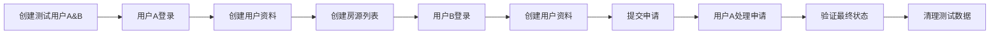

# Baliciaga Backend E2E Integration Test

## 概述

这个端到端(E2E)集成测试脚本自动验证整个Baliciaga后端业务流程，模拟两位用户的完整交互：
- 用户A（房东）创建房源并管理申请
- 用户B（租客）申请房源
- 完整的申请处理流程验证

## 测试流程



## 前置要求

### 1. 依赖安装
```bash
cd backend
npm install axios @aws-sdk/client-cognito-identity-provider
```

### 2. 权限配置
确保AWS凭证具有以下权限：
- `cognito-idp:SignUp`
- `cognito-idp:AdminConfirmSignUp` 
- `cognito-idp:InitiateAuth`
- `cognito-idp:AdminDeleteUser`

### 3. 后端部署
确保后端已部署并运行：
```bash
npx serverless deploy
```

## 配置

### 1. 复制配置文件
```bash
cp scripts/e2e-config.example.sh scripts/e2e-config.sh
```

### 2. 更新配置
编辑 `scripts/e2e-config.sh`：

```bash
# API配置
export API_BASE_URL="https://your-actual-api-gateway-url.amazonaws.com/dev"

# Cognito配置
export AWS_REGION="ap-southeast-1"
export COGNITO_USER_POOL_ID="ap-southeast-1_YourActualPoolId"
export COGNITO_USER_POOL_CLIENT_ID="your-actual-client-id"
```

### 3. 获取配置值

#### API_BASE_URL
从Serverless部署输出获取：
```bash
npx serverless info
```
查找 `ServiceEndpoint` 值

#### Cognito配置
从AWS控制台或CloudFormation输出获取：
```bash
aws cloudformation describe-stacks --stack-name baliciaga-backend-dev --query 'Stacks[0].Outputs'
```

## 运行测试

### 方法1: 使用配置文件
```bash
# 加载配置并运行
source scripts/e2e-config.sh && node scripts/e2e-test.js
```

### 方法2: 直接设置环境变量
```bash
API_BASE_URL="https://your-api.amazonaws.com/dev" \
COGNITO_USER_POOL_ID="ap-southeast-1_XXXXXXXXX" \
COGNITO_USER_POOL_CLIENT_ID="your-client-id" \
node scripts/e2e-test.js
```

### 方法3: 使用.env文件
创建 `.env` 文件：
```
API_BASE_URL=https://your-api.amazonaws.com/dev
COGNITO_USER_POOL_ID=ap-southeast-1_XXXXXXXXX
COGNITO_USER_POOL_CLIENT_ID=your-client-id
```

然后运行：
```bash
node -r dotenv/config scripts/e2e-test.js
```

## 测试输出

### 成功输出示例
```
🧪 Baliciaga Backend E2E Integration Test
==========================================

[START] ℹ️  🚀 Starting E2E Integration Test
[CONFIG] ℹ️  API Base URL: https://api.baliciaga.com/dev
[CONFIG] ℹ️  User Pool ID: ap-southeast-1_ABC123XYZ
[CONFIG] ℹ️  Test Users: test-1a2b3c4d@baliciaga-test.com, test-5e6f7g8h@baliciaga-test.com

[CREATE_USERS] ℹ️  👥 Creating test users...
[CREATE_USER] ✅ User signed up: test-1a2b3c4d@baliciaga-test.com
[CREATE_USER] ✅ User confirmed: test-1a2b3c4d@baliciaga-test.com
[CREATE_USER] ✅ User signed up: test-5e6f7g8h@baliciaga-test.com
[CREATE_USER] ✅ User confirmed: test-5e6f7g8h@baliciaga-test.com

[USER_A_SETUP] ℹ️  🏠 Setting up User A (Property Owner)...
[LOGIN] ✅ Successfully logged in: test-1a2b3c4d@baliciaga-test.com
[CREATE_PROFILE] ✅ Profile created for: Alice Johnson

[CREATE_LISTING] ℹ️  🏢 User A creating rental listing...
[CREATE_LISTING] ✅ Listing created with ID: lst_abc123xyz

[USER_B_SETUP] ℹ️  👤 Setting up User B (Applicant)...
[LOGIN] ✅ Successfully logged in: test-5e6f7g8h@baliciaga-test.com
[CREATE_PROFILE] ✅ Profile created for: Bob Smith

[SUBMIT_APPLICATION] ℹ️  📝 User B submitting application...
[SUBMIT_APPLICATION] ✅ Application submitted with ID: app_def456uvw

[PROCESS_APPLICATION] ℹ️  ✅ User A processing application...
[UPDATE_APPLICATION] ✅ Application status updated to: accepted

[VERIFY_RESULT] ℹ️  🔍 Verifying final application status...
[VERIFY_STATUS] ✅ Application status verified: accepted

[COMPLETE] ✅ 🎉 E2E Test successfully completed!
[SUMMARY] ℹ️  
📊 Test Summary:
   • User A (test-1a2b3c4d@baliciaga-test.com) created listing: lst_abc123xyz
   • User B (test-5e6f7g8h@baliciaga-test.com) submitted application: app_def456uvw
   • Application status successfully updated to: ACCEPTED
   • All API endpoints working correctly ✅

[CLEANUP] ✅ Deleted user: test-1a2b3c4d@baliciaga-test.com
[CLEANUP] ✅ Deleted user: test-5e6f7g8h@baliciaga-test.com

==========================================
[FINAL] ✅ All tests passed! Duration: 12.34s
```

## 测试覆盖

### 验证的API端点
- ✅ `POST /users/profile` - 用户资料创建
- ✅ `POST /listings` - 房源创建
- ✅ `POST /listings/{listingId}/applications` - 申请提交
- ✅ `PUT /applications/{applicationId}` - 申请状态更新
- ✅ `GET /listings/{listingId}/applications` - 申请列表查询

### 验证的业务流程
- ✅ 用户注册和认证流程
- ✅ 房源创建和管理
- ✅ 申请提交和处理
- ✅ 状态更新和查询
- ✅ 权限验证（token认证）

## 故障排除

### 常见错误

#### 1. 配置错误
```
[CONFIG] ❌ Please set COGNITO_USER_POOL_ID environment variable
```
**解决方案**: 检查环境变量设置

#### 2. API连接错误
```
[CREATE_LISTING] ❌ Failed to create listing: connect ECONNREFUSED
```
**解决方案**: 
- 检查API_BASE_URL是否正确
- 确认后端已部署并运行
- 检查网络连接

#### 3. 权限错误
```
[CREATE_USER] ❌ Failed to create user: AccessDenied
```
**解决方案**: 
- 检查AWS凭证
- 确认IAM权限包含Cognito操作

#### 4. Cognito配置错误
```
[LOGIN] ❌ Failed to log in: USER_PASSWORD_AUTH flow not enabled
```
**解决方案**: 
- 在Cognito用户池客户端中启用USER_PASSWORD_AUTH
- 或使用SRP认证流程

### 调试模式
设置详细日志：
```bash
DEBUG=1 node scripts/e2e-test.js
```

### 手动清理
如果测试中断，手动清理测试用户：
```bash
aws cognito-idp admin-delete-user \
  --user-pool-id YOUR_USER_POOL_ID \
  --username test-user-email@baliciaga-test.com
```

## CI/CD集成

### GitHub Actions示例
```yaml
name: E2E Test
on: [push, pull_request]
jobs:
  e2e-test:
    runs-on: ubuntu-latest
    steps:
      - uses: actions/checkout@v2
      - uses: actions/setup-node@v2
        with:
          node-version: '18'
      - run: npm ci
        working-directory: ./backend
      - run: npx serverless deploy
        working-directory: ./backend
        env:
          AWS_ACCESS_KEY_ID: ${{ secrets.AWS_ACCESS_KEY_ID }}
          AWS_SECRET_ACCESS_KEY: ${{ secrets.AWS_SECRET_ACCESS_KEY }}
      - run: node scripts/e2e-test.js
        working-directory: ./backend
        env:
          API_BASE_URL: ${{ secrets.API_BASE_URL }}
          COGNITO_USER_POOL_ID: ${{ secrets.COGNITO_USER_POOL_ID }}
          COGNITO_USER_POOL_CLIENT_ID: ${{ secrets.COGNITO_USER_POOL_CLIENT_ID }}
```

## 扩展测试

### 添加新测试场景
在 `e2e-test.js` 中添加新的测试函数：

```javascript
async function testAdditionalScenario() {
  // 实现新的测试场景
  log.info('NEW_TEST', 'Running additional test scenario...');
  // ... 测试逻辑
}

// 在main函数中调用
await testAdditionalScenario();
```

### 测试数据自定义
修改 `testUsers` 和 `testListing` 对象来自定义测试数据。

## 性能监控

脚本会自动记录执行时间和各步骤的性能指标。典型的执行时间：
- 总测试时间: 10-30秒
- 用户创建: 2-5秒
- API调用: 1-3秒每次

## 支持

如有问题，请检查：
1. 后端部署状态
2. AWS凭证和权限
3. 网络连接
4. Cognito配置

或联系开发团队获取支持。 